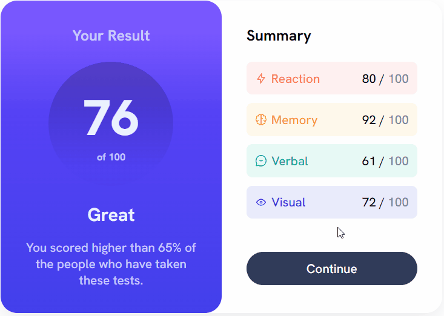

# Frontend Mentor | Profile card component

[](https://rrsf95.github.io/results-summary-component/)


## DESCRIÇÃO ✔

<strong>Desafio do FrontEnd Mentor - Profile card component.</strong>
<br><br> 
Link do desafio:
https://www.frontendmentor.io/challenges/results-summary-component-CE_K6s0maV
<br><br>
Este desafio foi executado com o intuito de aprofundar os conhecimentos em HTML e CSS.

## FUNCIONALIDADES DO PROJETO ⚙
O projeto se baseia em uma página web responsiva para desktop e mobile.

## TECNOLOGIAS UTILIZADAS 💻
- HTML
- CSS

Para este projeto foi utilizado HTML e CSS, por meio do Flexbox foram executadas as estilizações da estrutura criada pelo  HTML;

## COMO UTILIZAR 🛠
Clone o projeto do repositório para uma melhor compreensão do código;

```
https://github.com/RRSF95/results-summary-component.git
```

Caso queira somente visualizar a página, pode visitar o link abaixo:

https://rrsf95.github.io/results-summary-component/
## STATUS DO PROJETO 🏆
O projeto já está finalizado.


